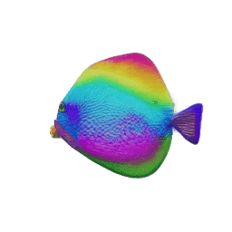
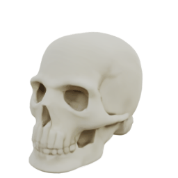
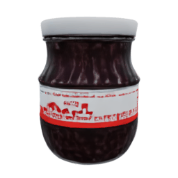
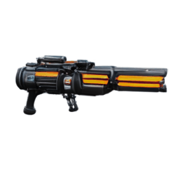
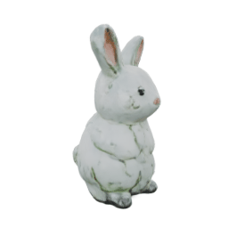
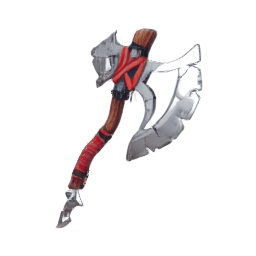
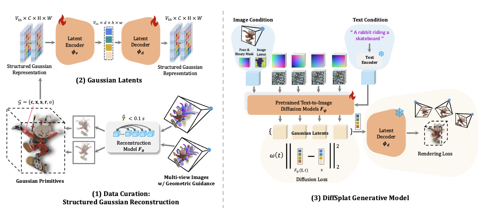

# [ICLR 2025] DiffSplat

<h4 align="center">

DiffSplat: Repurposing Image Diffusion Models for Scalable Gaussian Splat Generation

[Chenguo Lin](https://chenguolin.github.io), [Panwang Pan](https://paulpanwang.github.io), [Bangbang Yang](https://ybbbbt.com), [Zeming Li](https://www.zemingli.com), [Yadong Mu](http://www.muyadong.com)

[](https://arxiv.org/abs/2501.16764)
[](https://chenguolin.github.io/projects/DiffSplat)
[](https://huggingface.co/chenguolin/DiffSplat)

<p>
    
    
    
    
    
</p>
<p>
    
    
    
    
    
</p>
<p>
    
</p>

</h4>

This repository contains the official implementation of the paper: [DiffSplat: Repurposing Image Diffusion Models for Scalable Gaussian Splat Generation](https://arxiv.org/abs/2501.16764), which is accepted to ICLR 2025.
DiffSplat is a generative framework to synthesize 3D Gaussian Splats from text prompts & single-view images in 1~2 seconds. It is fine-tuned directly from a pretrained text-to-image diffusion model.

Feel free to contact me (chenguolin@stu.pku.edu.cn) or open an issue if you have any questions or suggestions.


## 📢 News

- **2025-01-29**: The source code and pretrained models are released. Happy 🐍 Chinese New Year 🎆!
- **2025-01-22**: InstructScene is accepted to ICLR 2025.


## 📋 TODO

- [ ] Provide detailed instructions for inference and training (may be available after the Chinese New Year vacation).
- [ ] Implement a Gradio demo.


## 🔧 Installation

You may need to modify the specific version of `torch` in `settings/setup.sh` according to your CUDA version.
There are not restrictions on the `torch` version, feel free to use your preferred one.
```bash
git clone https://github.com/chenguolin/DiffSplat.git
cd DiffSplat
bash settings/setup.sh
```


## 📊 Dataset

- We use [G-Objaverse](https://github.com/modelscope/richdreamer/tree/main/dataset/gobjaverse) with about 265K 3D objects and 10.6M rendered images (265K x 40 views) for `GSRecon` and `GSVAE` training. [Its subset](https://github.com/ashawkey/objaverse_filter) with about 83K 3D objects provided by [LGM](https://me.kiui.moe/lgm) is used for `DiffSplat` training.
- We find the filtering is crucial for the generation quality of `DiffSplat`, and a larger dataset is beneficial for the performance of `GSRecon` and `GSVAE`.
- We store the dataset in an internal HDFS cluster in this project. Thus, the training code can NOT be directly run on your local machine. Please implement your own dataloading logic referring to our provided dataset & dataloader code.


## 🚀 Usage

### Pretrained Models

All pretrained models are available at [Hugging Face🤗](https://huggingface.co/chenguolin/DiffSplat).

| **Model Name**                | **Fine-tined From** | **#Param.** | **Link** | **Note** |
|-------------------------------|---------------------|-------------|----------|----------|
| **ElevEst**                   | [dinov2_vitb14_reg](https://github.com/facebookresearch/dinov2)                    | 86 M            | [elevest_gobj265k_b_C25](https://huggingface.co/chenguolin/DiffSplat/tree/main/elevest_gobj265k_b_C25)         | (Optional) Single-image elevation estimation        |
| **GSRecon**                   | From scratch                    | 42M            | [gsrecon_gobj265k_cnp_even4](https://huggingface.co/chenguolin/DiffSplat/tree/main/gsrecon_gobj265k_cnp_even4)         | Feed-forward reconstruct per-pixel 3DGS from (RGB, normal, point) maps         |
| **GSVAE (SD)**                | [SD1.5 VAE](https://huggingface.co/stable-diffusion-v1-5/stable-diffusion-v1-5)                    | 84M            | [gsvae_gobj265k_sd](https://huggingface.co/chenguolin/DiffSplat/tree/main/gsvae_gobj265k_sd)         |          |
| **GSVAE (SDXL)**              | [SDXL fp16 VAE](https://huggingface.co/madebyollin/sdxl-vae-fp16-fix)                    | 84M            | [gsvae_gobj265k_sdxl_fp16](https://huggingface.co/chenguolin/DiffSplat/tree/main/gsvae_gobj265k_sdxl_fp16)         | fp16-fixed SDXL VAE is more robust         |
| **GSVAE (SD3)**               | [SD3 VAE](https://huggingface.co/stabilityai/stable-diffusion-3-medium)                    | 84M            | [gsvae_gobj265k_sd3](https://huggingface.co/chenguolin/DiffSplat/tree/main/gsvae_gobj265k_sd3)         |          |
| **DiffSplat (SD)**            | [SD1.5](https://huggingface.co/stable-diffusion-v1-5/stable-diffusion-v1-5)                    | 0.86B            | Text-cond: [gsdiff_gobj83k_sd15__render](https://huggingface.co/chenguolin/DiffSplat/tree/main/gsdiff_gobj83k_sd15__render)<br> Image-cond: [gsdiff_gobj83k_sd15_image__render](https://huggingface.co/chenguolin/DiffSplat/tree/main/gsdiff_gobj83k_sd15_image__render)         | Best efficiency         |
| **DiffSplat (Pix-Art Sigma)** | [Pix-Art Sigma 512](https://huggingface.co/PixArt-alpha/PixArt-Sigma-XL-2-512-MS)                    | 0.61B            | Text-cond: [gsdiff_gobj83k_pas_fp16__render](https://huggingface.co/chenguolin/DiffSplat/tree/main/gsdiff_gobj83k_pas_fp16__render)<br> Image-cond: [gsdiff_gobj83k_pas_fp16_image__render](https://huggingface.co/chenguolin/DiffSplat/tree/main/gsdiff_gobj83k_pas_fp16_image__render)         | Best Trade-off         |
| **DiffSplat (SD3.5m)**         | [SD3.5 median](https://huggingface.co/stabilityai/stable-diffusion-3.5-medium)                    | 2.24B            | Text-cond: [gsdiff_gobj83k_sd35m__render](https://huggingface.co/chenguolin/DiffSplat/tree/main/gsdiff_gobj83k_sd35m__render)<br> Image-cond: [gsdiff_gobj83k_sd35m_image__render](https://huggingface.co/chenguolin/DiffSplat/tree/main/gsdiff_gobj83k_sd35m_image__render)         | Best performance        |
| **DiffSplat ControlNet (SD)**         | From scratch                    | 361M            | Depth: [gsdiff_gobj83k_sd15__render__depth](https://huggingface.co/chenguolin/DiffSplat/tree/main/gsdiff_gobj83k_sd15__render__depth)<br> Normal: [gsdiff_gobj83k_sd15__render__normal](https://huggingface.co/chenguolin/DiffSplat/tree/main/gsdiff_gobj83k_sd15__render__normal)<br> Canny: [gsdiff_gobj83k_sd15__render__canny](https://huggingface.co/chenguolin/DiffSplat/tree/main/gsdiff_gobj83k_sd15__render__canny)         |          |


### Inference

Please refer to [infer_gsdiff_sd.py](./src/infer_gsdiff_sd.py), [infer_gsdiff_pas.py](./src/infer_gsdiff_pas.py), and [infer_gsdiff_sd3.py](./src/infer_gsdiff_sd3.py).

Instructions for `DiffSplat` inference will be provided soon.


### Training

#### 1. GSRecon

Please refer to [train_gsrecon.py](./src/train_gsrecon.py).

Instructions for `GSRecon` training will be provided soon.

#### 2. GSVAE

Please refer to [train_gsvae.py](./src/train_gsvae.py).

Instructions for `GSVAE` training will be provided soon.

#### 3. DiffSplat

Please refer to [train_gsdiff_sd.py](./src/train_gsdiff_sd.py), [train_gsdiff_pas.py](./src/train_gsdiff_pas.py), and [train_gsdiff_sd3.py](./src/train_gsdiff_sd3.py).

Instructions for `DiffSplat` training will be provided soon.

#### 4. ControlNet

Please refer to [train_gsdiff_sd_controlnet.py](./src/train_gsdiff_sd_controlnet.py) and [infer_gsdiff_sd.py](./src/infer_gsdiff_sd.py).

Instructions for `ControlNet` training and inference will be provided soon.


## 😊 Acknowledgement
We would like to thank the authors of [LGM](https://me.kiui.moe/lgm), [GRM](https://justimyhxu.github.io/projects/grm), and [Wonder3D](https://www.xxlong.site/Wonder3D) for their great work and generously providing source codes, which inspired our work and helped us a lot in the implementation.


## 📚 Citation
If you find our work helpful, please consider citing:
```bibtex
@inproceedings{lin2025diffsplat,
  title={DiffSplat: Repurposing Image Diffusion Models for Scalable 3D Gaussian Splat Generation},
  author={Lin, Chenguo and Pan, Panwang and Yang, Bangbang and Li, Zeming and Mu, Yadong},
  booktitle={International Conference on Learning Representations (ICLR)},
  year={2025}
}
```
